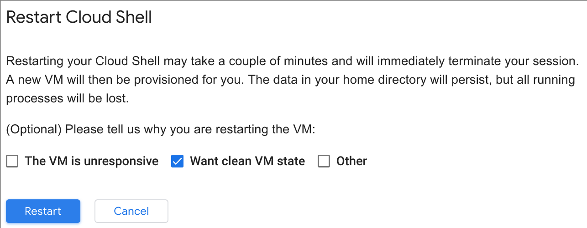

#  Google Cloudshell

> Setup a working emacs + spacemacs environment in Google Cloudshell

## [1-write-customize_environment.sh](./1-write-customize_environment.sh)
Initializes the Google Cloudshell container with emacs.

### Once launched, run
```bash
./org/google-cloudshell/1-write-customize_environment.sh
```

### Reset the environment

Go to restart in main menu

[]()

### Select to 'Want clean VM state' to reset the environment

[]()

### Post run

After you've waited for the environment to be prepared and you've got a shell again, you will now be able to launch `emacs`.

```bash
inotifywait  -m /google/devshell/ -e create && cd ~/ && emacs apisnoop/org/meta_bot.org
```

---

[](https://console.cloud.google.com/cloudshell/open?git_repo=https://github.com/cncf/apisnoop&tutorial=org/google-cloudshell/README.md)

---

Warning: if you have an existing `.customize_environment`, this script will remove it; proceed with caution
